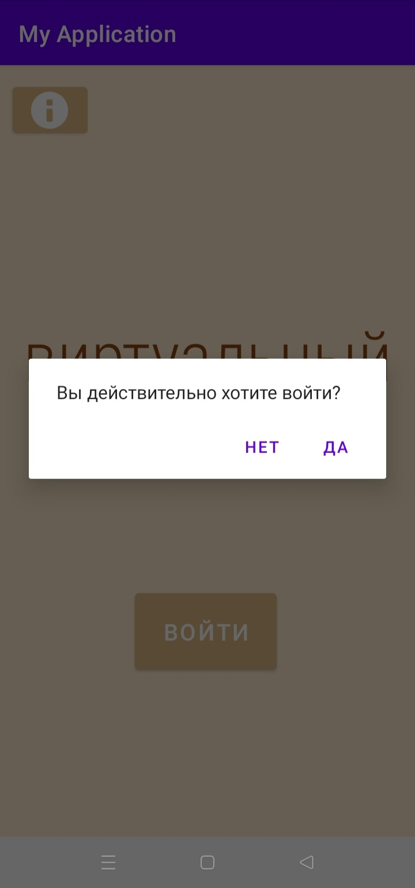
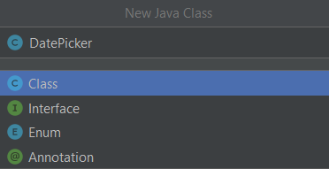
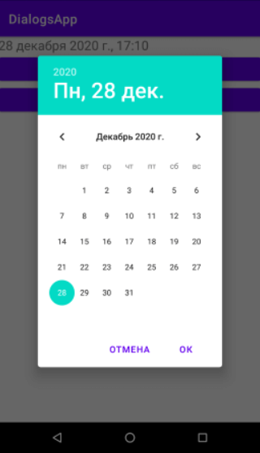

# PMU_Android


_Листинг 5.3. Пример диалогового окна типа AlertDialog_

```
package com.example.ch05;
import android.support.v7.app.AppCompatActivity;
import android.os.Bundle;
import android.content.Context;
import android.app.Dialog;
import android.content.Dialoglnterface;
inport android.app.AlertDialog;
public class MainActivity extends AppCompatActivity { 
@Override
protected void onCreate(Bundle savedlnstanceState) {
super.onCreate(savedlnstanceState); 
setContentView(R.layout.activityjnain);
AlertDialog.Builder altbld « new AlertDialog.Builder(this);
// Сообщение диалога
alt_bld.setMessage("Подключиться к серверу?")
.setCancelable(false)
.setPositiveButton("Да”, new Dialoglnterface.OnClickListener()
public void onClicMDialoglnterface dialog, int id) (
// Действие для кнопки Yes
}
))
.setNegativeButton("Heт", new Dialoglnterface.OnClickListener()
public void onClick(DialogInterface dialog, int id) (
// Действие для кнопки No dialog.cancel О;
}
));
AlertDialog alert = alt_bld.create();
// Title for AlertDialog alert.setTitle("Запрос");
// Icon for AlertDialog alert.show();
)

```

## 5.2.2. DatePickerDialog: диалоговое окно выбора даты

В Android существуют встроенные диалоговые окна выбора латы и времени, следо-вательно, вам не придется «изобретать велосипед» для создания таковых. В предыдущем издании этой книги было показано, как использовать оба эти диалоговых окна, однако API Android с тех пор изменился, и теперь диалоговые окна даты и времени вызываются иначе. Так, метод showDialog() считается устаревшим, и для отображения диалоговых окон нужно теперь использовать метод show().
Сейчас мы создадим приложение, отображающее диалоговое окно выбора даты. Разметка проекта предусматривает надпись, в которую будет выводиться дата, и кнопки __Выбор даты__ и __Ок__. По нажатию кнопки __Выбор даты__ открывается диалоговое окно выбора даты, по нажатию в этом окне кнопки __Ок__ выбранная дата отображается в надписи.
Прежде всего определим для нашего приложения некоторые константы (листинг 5.4) и занесем их в файл string.xml.

_Листинг 5.4. Строковые константы (файл res/values/string.xml)_

```
<resources>
<string name=*"app_name">Ch05</string>
<string name="choose_date">Выбор даты</string>
<string name-"ready">Готово</string> 
</resources>
```

Разметка нашего приложения приведена в листинге 5.5.

_Листинг 5.5. Разметка приложения (файл activity_maln.xml)_

```
<?xml version»"1.0" encoding="utf-8"?>
<android.support.constraint.ConstraintLayout xmlns:android»"http://schemas.android.com/apk/res/android" 
xmlns:app-"http://schemas.android.com/apk/res-auto" 
xmlns:tools="http://schemas.android.com/tools" 
android:layout_width="match_parent" 
android:layout_height="match_parent" 
tools:context-".MainActivity" 
tools:showln-"layout/activity_main">

<TextView
android:layout_width="wrap_content" 
android:layout_height»"wrap_content" 
android:text="16/09/1983" 
android:id-"0+id/tv"
app: layout_constraintBottocn_toBottamOf»"parent" 
app:layout_constra int Left_toLeftOf="parent" 
app:layout_constraintRight_toRightOf="parent" 
app:layout_constraintTop_toTopOf="parent" />
<Button
android:layout_width="wrap_content" 
android:layout_height-"wrap_content" 
android:text="Bы6op даты" android:id="0+id/button" 
android:layout_below-"0+id/tv" 
android:layout_alignParentLeft="true" 
android:layout_alignParentStart-"true" 
android:layout_marginTop="116dp" 
android:textSi2e="22sp" 
android:onClick-"onClick"/>
</android.support.constraint.ConstraintLayout>
```

Теперь в дереве проекта (крайняя левая панель Android Studio) щелкните правой кнопкой мыши на строке Jаvа/<название пакета>, выберите команду New|Java Class (рис. 5.4) и введите название класса: DatePicker. Код класса приведен в листинге 5.6.




_Листинг 5.6. Класс DatePicker (файл DatePicker.java)_ 

```
package com. example.chO5;
android.app.AlertDialog; 
android.app.DatePickerDialog; 
android.app.Dialog; 
android.content.Dialoglnterface; 
android.os.Bundle;
android.support.v4.app.Dialog Fragment; 
android.widget.Button; 
android.widget.TextView;

import java.util.Calendar;

public class DatePicker extends DialogFragment 
implements DatePickerDialog.OnDateSetListener{
@Override
public Dialog onCreateDialog(Bundle savedlnstanceState) {
// определяем текущую дату
final Calendar c = Calendar.getInstance();
int year = c.get(Calendar.YEAR);
int month = c.get(Calendar.MONTH);
int day = c.get(Calendar.DAY_OF_MONTH);
// создаем DatePickerDialog и возвращаем его 
Dialog picker = new DatePickerDialog{getActivity(), this, year, month, day);
picker.setTitle(getResources().getString(R.string.chooscdate)); 
return picker;
}
0Override 
public void onStartO { 
super.onStart();
// добавляем пользовательский текст для кнопки Button nButton =	{(AlertDialog) getDialog())
.getButton(DialogInterface.BUTTON_POSITIVE); nButton.setText(getResources().getString(R.string.ready));
}
@Override
public void onDateSet(android.widget.DatePicker datePicker, int year, int month, int day) (
TextView tv = (TextView) getActivity().findViewByld(R.id.tv); tv.setText(day +"-"+ month +"-"+ year);
}
}
```

Осталось только написать код для главной деятельности (листинг 5.7). Там все просто — мы определяем обработчик для нажатия кнопки. Само диалоговое окно выбора даты вызывается методом show():

```
DialogFragment dateDialog = new DatePicker();
dateDialog.show(getSupportFragmentManager(), "datePicker");
```

_Листинг 5.7. Файл MainActivity.java_

```
package com.example.ch05;
import android.support.v7.app.AppCompatActivity; 
import android.support.v4.app.DialogFragment; 
import android.os.Bundle; 
import android.view.View;
public class MainActivity extends AppCompatActivity {
@Override
protected void onCreate(Bundle savedlnstanceState) { 
super.onCreate(savedlnstanceState); 
setContentView(R.layout.activityjnain);
}
public void onClick(View v) {
DialogFragment dateDialog - new DatePicker(); 
dateDialog.show(getSupportFragmentManager(), "datePicker");
}
}
```

Теперь посмотрим на наше приложение в действии. Сначала отображается установленное для надписи значение по умолчанию и кнопка __Выбор даты__.
По нажатию кнопки __Выбор даты__ отображается наше диалоговое окно (рис. 5.5).



По нажатию в диалоговом окне кнопки __Ок__ выбранная дата устанавливается в качестве значения для надписи. 
Но с нашим диалоговым окном есть одна проблема.Почему-то нумерация месяцев начинается здесь с нуля, поэтому этот факт нужно учитывать и при установке даты увеличивать переменную month на единицу.

## 5.2.3. TimePickerDialog: диалоговое окно выбора времени

Диалоговое окно TimePickerDialog работает аналогично диалоговому окну выбора даты. Прежде всего, как обычно, определим файл со строковыми константами: res\values\string.xml (листинг 5.8).

_Листинг 5.8. Строковые константы (файл res\values\string.xml)_

```
<resources>
<string name="app_name">TimePicker</string>
<string name-"choose_time">Установите время</string> 
<string name="ready">Готово</string>
<string name-"hours">Часы </string>
<string r.anve“"minutes">Минуты </string>
</resources>
```

Затем создаем класс TimePickerFragment подобно тому, как мы ранее создавали класс DatePicker (листинг 5.9).
